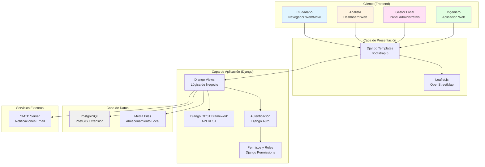
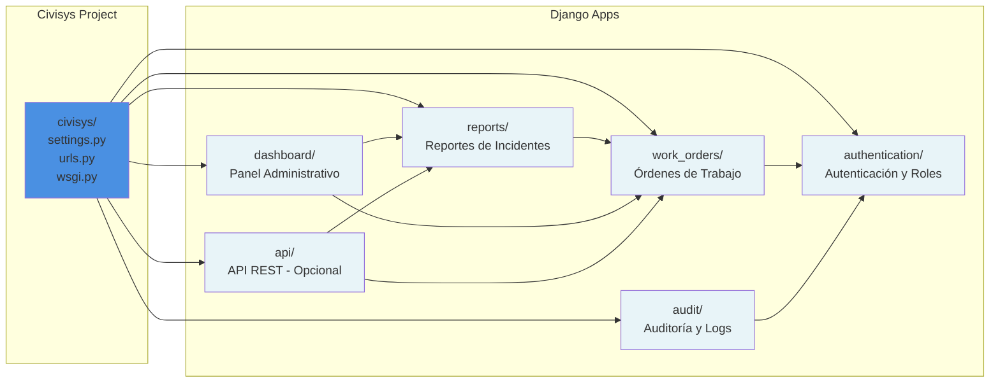
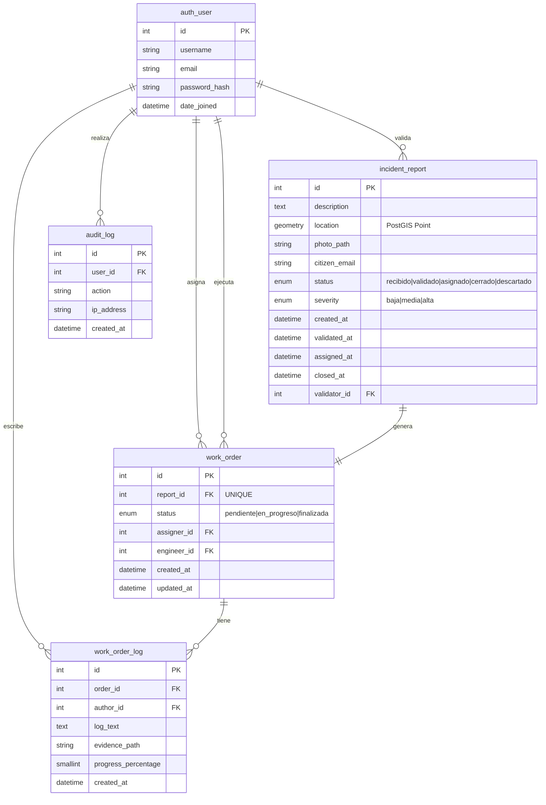
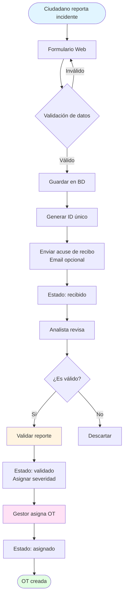
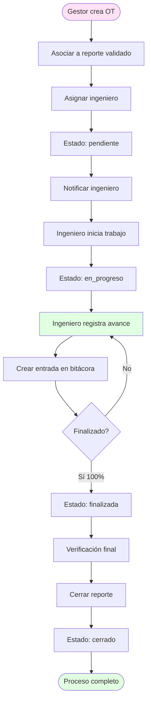
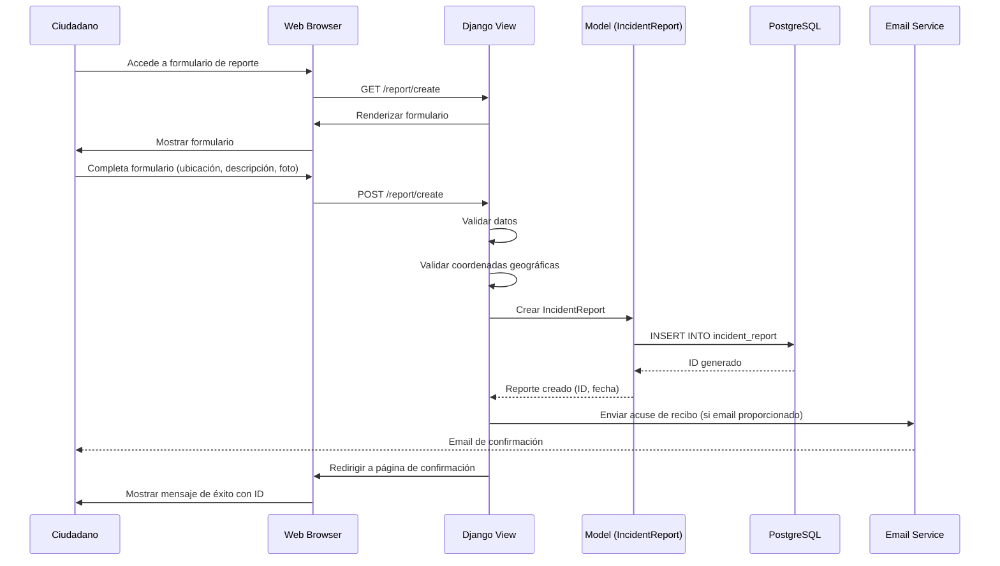
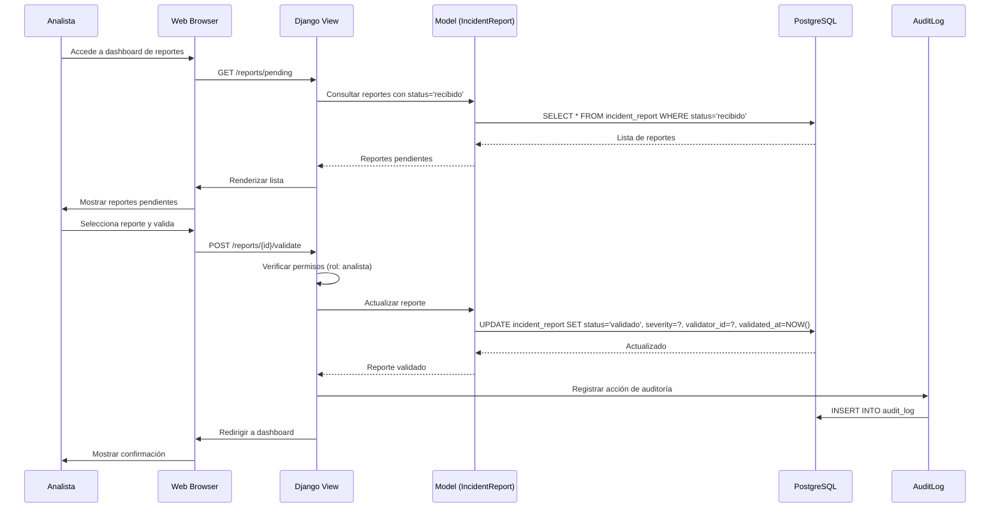
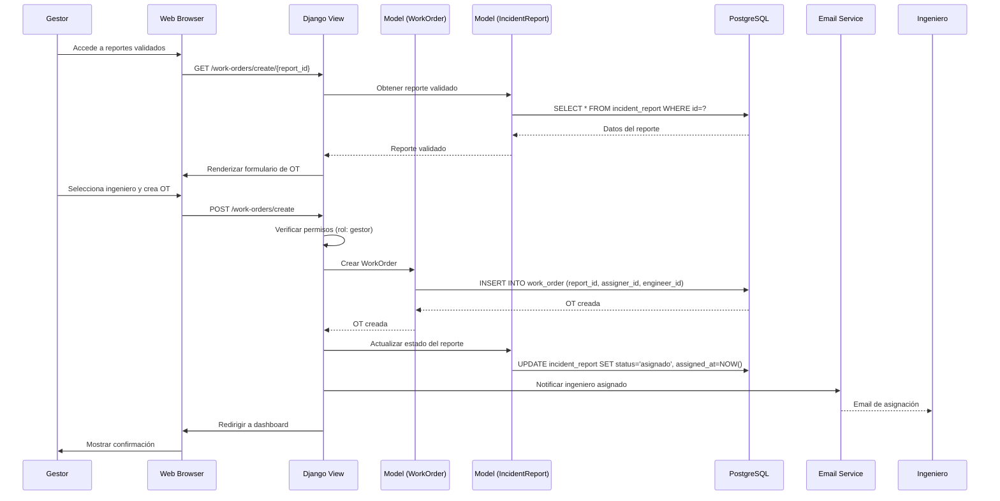
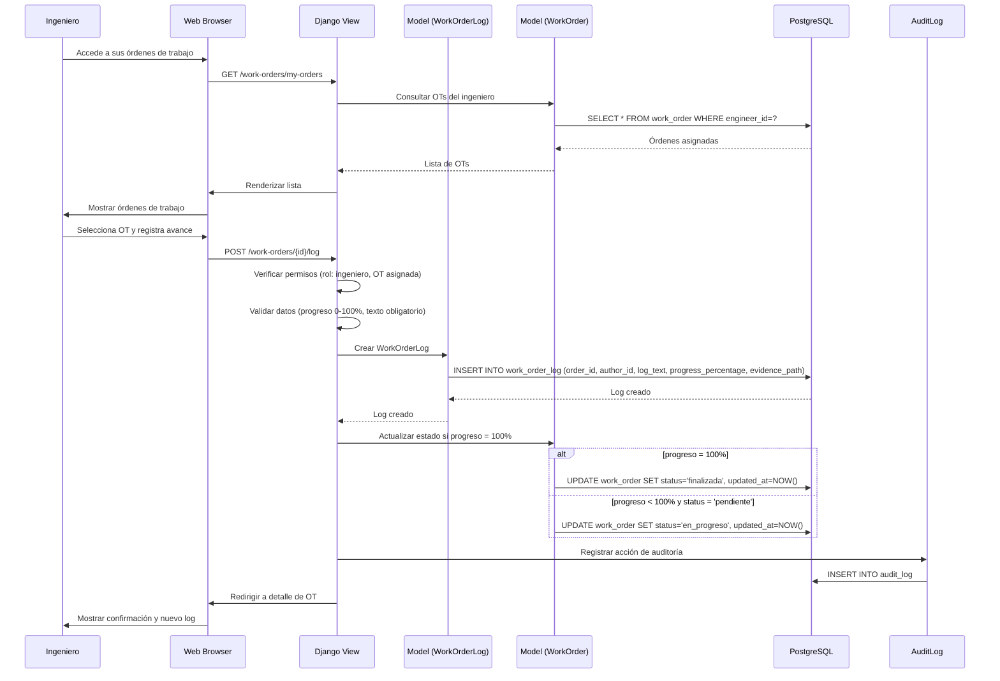
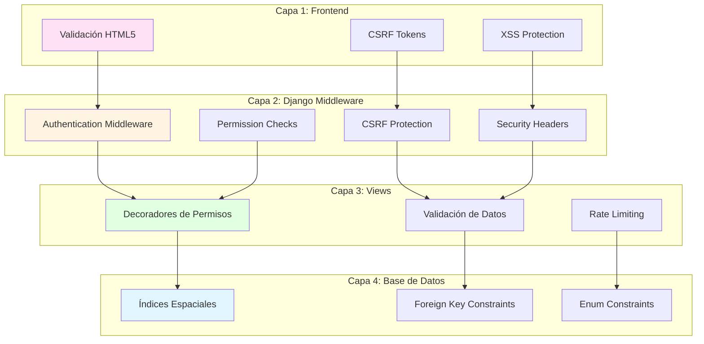

# 🏗️ ARCHITECTURE.md - Arquitectura del Sistema Civisys

**Versión:** 1.0  
**Fecha:** 2025-11-04  
**Autor:** Equipo Civisys

---

## 📋 Índice

1. [Arquitectura de Alto Nivel](#1-arquitectura-de-alto-nivel)
2. [Stack Tecnológico](#2-stack-tecnológico)
3. [Arquitectura de Componentes](#3-arquitectura-de-componentes)
4. [Modelo de Datos](#4-modelo-de-datos)
5. [Flujos de Datos Principales](#5-flujos-de-datos-principales)
6. [Diagramas de Secuencia](#6-diagramas-de-secuencia)
7. [Decisiones de Arquitectura](#7-decisiones-de-arquitectura)
8. [Seguridad y Auditoría](#8-seguridad-y-auditoría)

---

## 1. Arquitectura de Alto Nivel

### 1.1. Vista General del Sistema



### 1.2. Capas del Sistema

| Capa | Tecnología | Responsabilidad |
|------|-----------|-----------------|
| **Presentación** | HTML5, CSS3, Bootstrap 5, JavaScript, Leaflet.js | Interfaz de usuario, visualización de mapas, responsive design |
| **Aplicación** | Django 4+, Django REST Framework | Lógica de negocio, autenticación, autorización, validación |
| **Datos** | PostgreSQL + PostGIS | Almacenamiento persistente, consultas geográficas |
| **Almacenamiento** | Sistema de archivos local | Media files (fotos, documentos) |
| **Comunicación** | SMTP (Gmail/SendGrid gratuito) | Notificaciones por correo electrónico |

---

## 2. Stack Tecnológico

### 2.1. Backend

```python
# Framework Principal
Django 4.2+                    # Framework web robusto
Django REST Framework 3.14+    # API REST (si se requiere)
django-cors-headers            # CORS para frontend
django-gis                     # Integración PostGIS nativa

# Base de Datos
psycopg2-binary               # Driver PostgreSQL
PostGIS 3.0+                  # Extensión geográfica

# Autenticación y Seguridad
django-allauth (opcional)      # Si se requiere OAuth
django-ratelimit               # Rate limiting
argon2-cffi                    # Hash de contraseñas (recomendado)

# Utilidades
python-decouple                # Manejo de variables de entorno
Pillow                         # Procesamiento de imágenes
reportlab                      # Generación de PDFs
```

### 2.2. Frontend

```javascript
// CSS Framework
Bootstrap 5.3+                 // Mobile-first, responsive

// Mapas
Leaflet.js 1.9+                // Librería de mapas ligera
Leaflet.draw                   // Dibujo en mapas (opcional)

// JavaScript
Vanilla JS (ES6+)              // Sin frameworks pesados (baja conectividad)
```

### 2.3. Base de Datos

```
PostgreSQL 14+
PostGIS 3.0+                   // Extensión para datos geográficos
```

---

## 3. Arquitectura de Componentes

### 3.1. Estructura de Apps Django



### 3.2. Responsabilidades por App

| App Django | Responsabilidad | Modelos Principales |
|------------|-----------------|---------------------|
| **reports** | Gestión de reportes de incidentes | `IncidentReport` |
| **work_orders** | Gestión de órdenes de trabajo y bitácoras | `WorkOrder`, `WorkOrderLog` |
| **authentication** | Autenticación, roles y permisos | Extiende `auth.User`, `Groups` |
| **dashboard** | Paneles administrativos y estadísticas | Vistas y agregaciones |
| **api** | API REST (opcional para futuras integraciones) | Serializers, ViewSets |
| **audit** | Logs de auditoría y trazabilidad | `AuditLog` |

---

## 4. Modelo de Datos

### 4.1. Diagrama Entidad-Relación (ER)



### 4.2. Relaciones Clave

| Relación | Tipo | Descripción |
|----------|------|-------------|
| `incident_report` → `work_order` | **1:1** | Un reporte validado genera una única orden de trabajo |
| `work_order` → `work_order_log` | **1:N** | Una orden puede tener múltiples entradas de bitácora |
| `auth_user` → `incident_report` | **1:N** | Un analista puede validar múltiples reportes |
| `auth_user` → `work_order` | **1:N** | Un gestor puede asignar múltiples órdenes |
| `auth_user` → `work_order_log` | **1:N** | Un ingeniero puede escribir múltiples bitácoras |

---

## 5. Flujos de Datos Principales

### 5.1. Flujo de Reporte de Incidente



### 5.2. Flujo de Gestión de Orden de Trabajo



---

## 6. Diagramas de Secuencia

### 6.1. Secuencia: Reporte de Incidente por Ciudadano



### 6.2. Secuencia: Validación de Reporte por Analista



### 6.3. Secuencia: Asignación de Orden de Trabajo por Gestor



### 6.4. Secuencia: Registro de Avance por Ingeniero



---

## 7. Decisiones de Arquitectura

### 7.1. Patrón MVC de Django

**Decisión:** Usar el patrón MVT (Model-View-Template) nativo de Django.

**Justificación:**
- Separación clara de responsabilidades
- ORM de Django facilita el trabajo con PostGIS
- Templates reutilizables y fáciles de mantener
- Sistema de autenticación integrado

### 7.2. Base de Datos: PostgreSQL + PostGIS

**Decisión:** PostgreSQL con extensión PostGIS en lugar de SQLite.

**Justificación:**
- PostGIS es el estándar para datos geográficos
- Soporte nativo para consultas espaciales (ST_Distance, ST_Within, etc.)
- Índices GIST para optimizar búsquedas geográficas
- Escalabilidad y robustez para producción

### 7.3. Frontend: Bootstrap 5 (Sin Framework JS)

**Decisión:** Bootstrap 5 sin frameworks JavaScript pesados (React, Vue, Angular).

**Justificación:**
- **Baja conectividad:** Los usuarios en zonas rurales necesitan interfaces ligeras
- **Mobile-first:** Bootstrap 5 es responsive por defecto
- **Rápido de cargar:** Menor tiempo de carga mejora la experiencia
- **Fácil mantenimiento:** Menos dependencias y complejidad

### 7.4. Mapas: Leaflet.js + OpenStreetMap

**Decisión:** Leaflet.js con OpenStreetMap en lugar de Google Maps.

**Justificación:**
- **Costo cero:** OpenStreetMap es gratuito, Google Maps requiere API key con costos
- **Ligero:** Leaflet.js es más liviano que alternativas
- **Open Source:** Control total sobre la implementación
- **Offline-capable:** Puede funcionar con tiles precargadas

### 7.5. Autenticación: Django Auth Nativo

**Decisión:** Usar el sistema de autenticación nativo de Django con Groups.

**Justificación:**
- Ya incluido en Django, sin dependencias adicionales
- Sistema de permisos robusto
- Fácil de extender con custom user model si se requiere
- Seguridad probada (Argon2 para hashing de contraseñas)

### 7.6. Almacenamiento de Media: Sistema de Archivos Local

**Decisión:** Almacenar archivos (fotos) en el sistema de archivos local.

**Justificación:**
- **Costo cero:** No requiere servicios de almacenamiento en la nube pagados
- **Simplicidad:** Django maneja esto nativamente
- **Rendimiento:** Acceso directo a archivos es rápido

**Nota:** Para producción, considerar migración a S3-compatible gratuito (MinIO) si se requiere escalabilidad.

---

## 8. Seguridad y Auditoría

### 8.1. Capas de Seguridad



### 8.2. Auditoría y Trazabilidad

**Principios:**
- **Inmutabilidad:** Los logs de auditoría no se modifican ni eliminan
- **Completitud:** Toda acción crítica genera un registro
- **Atribución:** Cada acción está asociada a un usuario (si está autenticado)
- **Temporalidad:** Timestamps precisos para análisis posterior

**Acciones Auditadas:**
- Login exitoso/fallido
- Validación de reportes
- Creación de órdenes de trabajo
- Actualización de avances
- Exportación de datos
- Cambios de permisos

---

## 9. Escalabilidad Futura

### 9.1. Consideraciones para Escalado

**Fase 1 (MVP - Actual):**
- Servidor único
- PostgreSQL local
- Archivos en sistema de archivos

**Fase 2 (Crecimiento):**
- Servidor de aplicación separado
- Base de datos dedicada
- CDN para archivos estáticos (Cloudflare gratuito)
- Caché Redis (opcional)

**Fase 3 (Alta Demanda):**
- Load balancer
- Múltiples instancias de Django
- Replicación de base de datos
- Almacenamiento S3-compatible (MinIO)

### 9.2. Optimizaciones Geográficas

- **Índices GIST:** Ya implementados para consultas espaciales
- **Clustering:** Agrupar reportes cercanos en mapas
- **Caché de tiles:** Precargar tiles de OpenStreetMap para zonas frecuentes
- **Lazy loading:** Cargar reportes del mapa según zoom level

---

## 10. Referencias

- **Esquema de Base de Datos:** `/context/database.sql`
- **Guía para Agentes:** `/agents.md`
- **Documentación del Proyecto:** `/README.md`
- **Django GIS Documentation:** https://docs.djangoproject.com/en/stable/ref/contrib/gis/
- **PostGIS Documentation:** https://postgis.net/documentation/

---

**Última actualización:** 2025-11-04  
**Mantenido por:** Equipo de Desarrollo Civisys

