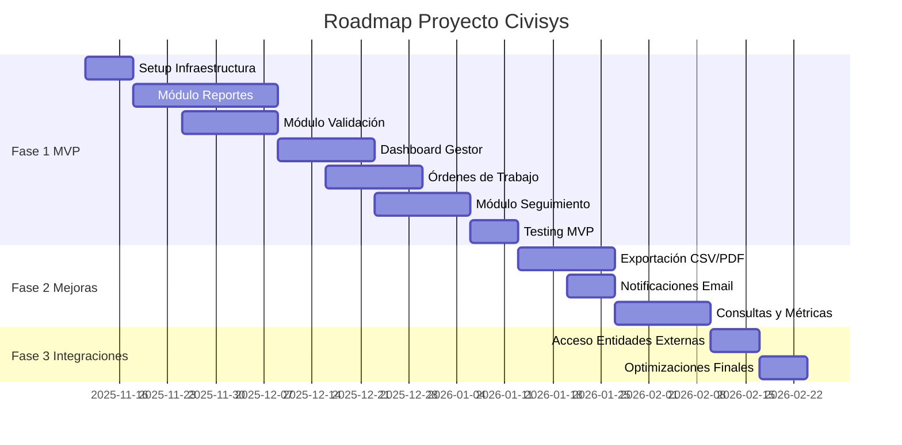

# 📋 PROJECT_PLAN.md - Plan de Proyecto Civisys

**Versión:** 1.0  
**Fecha:** 2025-11-04  
**Autor:** Equipo Civisys

---

## 📋 Índice

1. [Resumen Ejecutivo](#1-resumen-ejecutivo)
2. [Objetivos del Proyecto](#2-objetivos-del-proyecto)
3. [Alcance del Proyecto](#3-alcance-del-proyecto)
4. [Fases del Proyecto](#4-fases-del-proyecto)
5. [Estimaciones Detalladas](#5-estimaciones-detalladas)
6. [Perfiles y Responsabilidades](#6-perfiles-y-responsabilidades)
7. [Timeline y Roadmap](#7-timeline-y-roadmap)
8. [Recursos Necesarios](#8-recursos-necesarios)
9. [Métricas de Éxito](#9-métricas-de-éxito)
10. [Estrategia de Despliegue](#10-estrategia-de-despliegue)

---

## 1. Resumen Ejecutivo

### 1.1. Visión General

**Proyecto:** Sistema de Información Civil (Civisys)  
**Objetivo:** Plataforma de gestión y seguimiento de riesgos por derrumbes en corredores viales de Colombia  
**Duración Estimada:** 12-16 semanas (MVP en 8-10 semanas)  
**Metodología:** Ágil (Scrum/Kanban) con enfoque TDD  
**Stack Tecnológico:** Python/Django, PostgreSQL+PostGIS, Bootstrap 5, Leaflet.js

### 1.2. Estimación Total

| Métrica | Valor |
|---------|-------|
| **Total Story Points** | ~80 SP (después de dividir tickets complejos) |
| **Tickets Total** | ~34 tickets |
| **Duración MVP** | 8-10 semanas |
| **Duración Total** | 12-16 semanas |
| **Equipo Recomendado** | 2-3 desarrolladores |
| **Presupuesto** | $0 (costo cero - herramientas gratuitas) |

---

## 2. Objetivos del Proyecto

### 2.1. Objetivos Principales

1. **Centralizar reportes:** Unificar todos los reportes de incidentes en un sistema único
2. **Trazabilidad completa:** Garantizar trazabilidad del ciclo completo (Reporte → Validación → Asignación → Seguimiento → Cierre)
3. **Priorización automática:** Permitir priorización basada en severidad
4. **Acceso público:** Permitir a ciudadanos reportar incidentes sin barreras
5. **Costo cero:** Utilizar únicamente herramientas gratuitas y open source

### 2.2. Objetivos de Negocio

- Reducir tiempo medio de respuesta inicial en 50%
- Aumentar trazabilidad de incidentes cerrados al 100%
- Mejorar coordinación entre ciudadanos, alcaldías y equipos técnicos
- Facilitar toma de decisiones basada en datos consolidados

---

## 3. Alcance del Proyecto

### 3.1. Incluido (MVP)

✅ **Módulo de Reportes:**
- Formulario público de reporte de incidentes
- Selección de ubicación en mapa
- Adjuntar fotos de evidencia
- Consulta de estado de reporte

✅ **Módulo de Validación:**
- Dashboard de reportes pendientes para analistas
- Validación y clasificación por severidad
- Descartar reportes inválidos

✅ **Módulo de Gestión:**
- Dashboard de reportes validados para gestores
- Creación de órdenes de trabajo
- Asignación de ingenieros
- Visualización en mapa

✅ **Módulo de Seguimiento:**
- Panel de órdenes de trabajo para ingenieros
- Registro de avance con bitácora
- Adjuntar fotos de evidencia
- Historial de bitácoras

✅ **Módulo de Auditoría:**
- Logs de todas las acciones críticas
- Trazabilidad completa de cambios

### 3.2. Excluido (Futuras Fases)

❌ **Funcionalidades Post-MVP:**
- Exportación a PDF/CSV (Fase 2)
- Notificaciones por email (Fase 2)
- Historial y métricas avanzadas (Fase 2)
- Acceso de entidades externas (Fase 3)
- API REST pública (Fase 3)
- Aplicación móvil nativa (Fase 4)

---

## 4. Fases del Proyecto

### 4.1. Fase 1: MVP (Crítico) - 8-10 semanas

**Objetivo:** Implementar funcionalidades core para operación básica

**Tickets Incluidos (Prioridad Alta):**

| Grupo | Tickets | Story Points | Duración Estimada |
|-------|---------|--------------|-------------------|
| **Reportes** | PRO-17, PRO-18, PRO-19, PRO-21 | 9 SP | 2-3 semanas |
| **Validación** | PRO-22, PRO-23, PRO-24 | 8 SP | 2 semanas |
| **Dashboard Gestor** | PRO-25, PRO-26, PRO-27 | 7 SP | 2 semanas |
| **Órdenes de Trabajo** | PRO-28, PRO-29, PRO-30 | 7 SP | 2 semanas |
| **Seguimiento** | PRO-13, PRO-33, PRO-35 | 8 SP | 2 semanas |
| **Infraestructura** | Setup Django, BD, Auth | 5 SP | 1 semana |
| **Total Fase 1** | **~20 tickets** | **44 SP** | **8-10 semanas** |

**Entregables:**
- Sistema funcional con reportes, validación, dashboard y seguimiento
- Base de datos PostgreSQL+PostGIS configurada
- Autenticación y autorización por roles
- Interfaz mobile-first básica
- Despliegue en servidor de prueba

### 4.2. Fase 2: Mejoras y Exportación - 3-4 semanas

**Objetivo:** Agregar funcionalidades de exportación, notificaciones y métricas

**Tickets Incluidos (Prioridad Media):**

| Grupo | Tickets | Story Points | Duración Estimada |
|-------|---------|--------------|-------------------|
| **Exportación** | PRO-31, PRO-32 | 6 SP | 1-2 semanas |
| **Notificaciones** | PRO-20, PRO-30, PRO-36 | 6 SP | 1 semana |
| **Consultas** | PRO-6, PRO-15 | 5 SP | 1 semana |
| **Métricas** | PRO-8, PRO-27 (mejoras) | 5 SP | 1 semana |
| **Total Fase 2** | **~8 tickets** | **22 SP** | **3-4 semanas** |

**Entregables:**
- Exportación a CSV y PDF
- Notificaciones por email operativas
- Consulta pública de estado de reportes
- Métricas y estadísticas básicas

### 4.3. Fase 3: Integraciones y Acceso Externo - 2 semanas

**Objetivo:** Agregar acceso para entidades externas y mejoras finales

**Tickets Incluidos (Prioridad Baja):**

| Grupo | Tickets | Story Points | Duración Estimada |
|-------|---------|--------------|-------------------|
| **Entidades Externas** | PRO-16 | 5 SP | 1 semana |
| **Mejoras y Optimizaciones** | Varios | 5 SP | 1 semana |
| **Total Fase 3** | **~2-3 tickets** | **10 SP** | **2 semanas** |

**Entregables:**
- Panel de acceso para entidades externas (solo lectura)
- Optimizaciones de rendimiento
- Documentación completa
- Despliegue en producción

---

## 5. Estimaciones Detalladas

### 5.1. Estimación por Story Points

| Fase | Story Points | Horas Estimadas* | Días Estimados* |
|------|--------------|------------------|-----------------|
| **Fase 1 (MVP)** | 44 SP | 352 horas | 44 días (8.8 semanas) |
| **Fase 2 (Mejoras)** | 22 SP | 176 horas | 22 días (4.4 semanas) |
| **Fase 3 (Integraciones)** | 10 SP | 80 horas | 10 días (2 semanas) |
| **Buffer (20%)** | 15 SP | 120 horas | 15 días (3 semanas) |
| **Total** | **91 SP** | **728 horas** | **91 días (18.2 semanas)** |

\* Asumiendo 1 SP = 8 horas y 1 día = 8 horas de trabajo

### 5.2. Desglose por Tipo de Trabajo

| Tipo de Trabajo | Porcentaje | Horas Estimadas |
|-----------------|------------|-----------------|
| **Desarrollo Backend** | 35% | 255 horas |
| **Desarrollo Frontend** | 25% | 182 horas |
| **Configuración BD/PostGIS** | 10% | 73 horas |
| **Testing (TDD)** | 15% | 109 horas |
| **Documentación** | 5% | 36 horas |
| **Setup y DevOps** | 10% | 73 horas |
| **Total** | **100%** | **728 horas** |

### 5.3. Estimación por Equipo

**Escenario 1: Equipo de 1 desarrollador (Full-stack)**
- Duración: 18-20 semanas
- Horas por semana: 40 horas
- Ventaja: Control total, sin overhead de coordinación
- Desventaja: Más lento, riesgo de burnout

**Escenario 2: Equipo de 2 desarrolladores**
- Duración: 10-12 semanas
- Horas por semana: 40 horas c/u
- Distribución sugerida:
  - Dev 1: Backend + BD + DevOps (50%)
  - Dev 2: Frontend + Testing + UX (50%)
- Ventaja: Balanceado, velocidad óptima
- Desventaja: Requiere coordinación

**Escenario 3: Equipo de 3 desarrolladores**
- Duración: 8-10 semanas
- Horas por semana: 40 horas c/u
- Distribución sugerida:
  - Dev 1: Backend + BD (33%)
  - Dev 2: Frontend + UX (33%)
  - Dev 3: Testing + DevOps + Documentación (33%)
- Ventaja: Más rápido, especialización
- Desventaja: Más overhead de coordinación

**Recomendación:** Equipo de 2 desarrolladores (Escenario 2)

---

## 6. Perfiles y Responsabilidades

### 6.1. Perfiles Necesarios

#### 6.1.1. Desarrollador Full-Stack (Backend-focused)

**Responsabilidades:**
- Implementación de modelos Django con PostGIS
- Desarrollo de vistas y lógica de negocio
- Configuración de base de datos PostgreSQL+PostGIS
- Implementación de autenticación y autorización
- APIs y endpoints REST
- Testing backend (unitarios e integración)

**Habilidades Requeridas:**
- Python 3.x (avanzado)
- Django 4+ (avanzado)
- PostgreSQL + PostGIS (intermedio)
- Django ORM y GeoDjango
- Testing (pytest, unittest)
- Git y control de versiones

**Tiempo Estimado:** 40 horas/semana × 10-12 semanas

#### 6.1.2. Desarrollador Full-Stack (Frontend-focused)

**Responsabilidades:**
- Desarrollo de templates Django
- Implementación de interfaz Bootstrap 5
- Integración de Leaflet.js para mapas
- Validación client-side
- UX/UI mobile-first
- Testing frontend

**Habilidades Requeridas:**
- HTML5, CSS3 (avanzado)
- JavaScript (ES6+) (intermedio-avanzado)
- Bootstrap 5 (avanzado)
- Leaflet.js (intermedio)
- Django Templates (intermedio)
- Responsive design

**Tiempo Estimado:** 40 horas/semana × 10-12 semanas

#### 6.1.3. DevOps/Infraestructura (Part-time, opcional)

**Responsabilidades:**
- Configuración de servidor (VPS o similar)
- Setup de PostgreSQL+PostGIS
- Configuración de SSL (Let's Encrypt)
- Deployment automatizado
- Monitoreo básico
- Backup y recuperación

**Habilidades Requeridas:**
- Linux (Ubuntu/Debian)
- Docker (opcional)
- Nginx o Apache
- PostgreSQL administración
- SSL/TLS
- Git CI/CD básico

**Tiempo Estimado:** 20 horas/semana × 2-3 semanas (setup inicial) + 5 horas/semana (mantenimiento)

### 6.2. Matriz de Responsabilidades (RACI)

| Tarea | Dev Backend | Dev Frontend | DevOps | Product Owner |
|-------|-------------|--------------|--------|---------------|
| **Modelos y BD** | R/A | C | C | I |
| **Vistas Backend** | R/A | C | - | I |
| **Templates Frontend** | C | R/A | - | I |
| **Mapas Leaflet** | C | R/A | - | I |
| **Testing** | R | R | - | I |
| **Deployment** | C | C | R/A | I |
| **Documentación** | R | R | C | A |

**Leyenda:**
- **R** = Responsible (Ejecuta)
- **A** = Accountable (Responsable final)
- **C** = Consulted (Consultado)
- **I** = Informed (Informado)

---

## 7. Timeline y Roadmap

### 7.1. Roadmap Visual

### 7.2. Hitos Principales

| Hito | Fecha Estimada | Entregable |
|------|----------------|------------|
| **Hito 1: Setup Completo** | Semana 1 | Proyecto Django configurado, BD PostGIS funcionando |
| **Hito 2: Reportes Funcionales** | Semana 4 | Ciudadanos pueden reportar incidentes |
| **Hito 3: Validación Operativa** | Semana 6 | Analistas pueden validar y clasificar reportes |
| **Hito 4: Dashboard Gestor** | Semana 8 | Gestores pueden ver reportes y crear OTs |
| **Hito 5: Seguimiento Completo** | Semana 10 | Ingenieros pueden registrar avances |
| **Hito 6: MVP Completo** | Semana 10 | Sistema funcional end-to-end |
| **Hito 7: Exportación** | Semana 12 | Exportación a CSV/PDF operativa |
| **Hito 8: Notificaciones** | Semana 13 | Sistema de emails funcionando |
| **Hito 9: Producción** | Semana 16 | Sistema desplegado en producción |

---

## 8. Recursos Necesarios

### 8.1. Recursos de Hardware

| Recurso | Especificación Mínima | Especificación Recomendada |
|---------|----------------------|---------------------------|
| **Servidor de Desarrollo** | 2 CPU, 4GB RAM, 20GB SSD | 4 CPU, 8GB RAM, 50GB SSD |
| **Servidor de Producción** | 2 CPU, 4GB RAM, 50GB SSD | 4 CPU, 8GB RAM, 100GB SSD |
| **Base de Datos** | PostgreSQL 14+, 10GB | PostgreSQL 14+, 50GB con backups |
| **Almacenamiento Media** | 10GB | 50GB (fotos y documentos) |

**Opciones de Hosting Gratuitas/Baratas:**
- **Render.com** (Free tier para PostgreSQL)
- **Railway.app** (Free tier limitado)
- **DigitalOcean** ($6/mes - VPS básico)
- **VPS autoalojado** (opcional)

### 8.2. Recursos de Software

| Software | Versión | Licencia | Costo |
|----------|---------|----------|-------|
| **Python** | 3.11+ | Open Source | $0 |
| **Django** | 4.2+ | Open Source | $0 |
| **PostgreSQL** | 14+ | Open Source | $0 |
| **PostGIS** | 3.0+ | Open Source | $0 |
| **Bootstrap** | 5.3+ | Open Source | $0 |
| **Leaflet.js** | 1.9+ | Open Source | $0 |
| **OpenStreetMap** | - | Open Source | $0 |
| **GitHub** | - | Gratis (público) | $0 |
| **Let's Encrypt** | - | Gratis | $0 |

**Total Costo Software:** $0

### 8.3. Servicios Externos

| Servicio | Propósito | Costo Estimado |
|----------|-----------|----------------|
| **SMTP (Gmail)** | Notificaciones email | $0 (gratis) |
| **SendGrid** | Alternativa SMTP | $0 (plan gratuito) |
| **Dominio** | Nombre de dominio | $10-15/año (opcional) |
| **SSL** | Certificado HTTPS | $0 (Let's Encrypt) |

**Total Costo Servicios:** $0-15/año (solo dominio opcional)

---

## 9. Métricas de Éxito

### 9.1. Métricas Técnicas

| Métrica | Objetivo | Medición |
|---------|----------|----------|
| **Cobertura de Tests** | > 80% | pytest-cov |
| **Tiempo de Carga** | < 2 segundos | Lighthouse/DevTools |
| **Uptime** | > 99% | Monitoreo básico |
| **Errores en Producción** | < 1% de requests | Logs de errores |
| **Tiempo de Respuesta API** | < 500ms | Logs de performance |

### 9.2. Métricas de Negocio

| Métrica | Objetivo | Medición |
|---------|----------|----------|
| **Tiempo Medio de Respuesta** | Reducción 50% | Análisis de timestamps |
| **Trazabilidad de Incidentes** | 100% | Logs de auditoría |
| **Reportes por Mes** | > 100 | Dashboard de métricas |
| **Tasa de Validación** | < 24 horas | Análisis de tiempos |
| **Satisfacción de Usuarios** | > 80% | Encuestas (futuro) |

### 9.3. KPIs del Proyecto

| KPI | Objetivo | Estado Actual |
|-----|----------|---------------|
| **MVP en Producción** | Semana 10 | Pendiente |
| **Tickets Completados** | 34 tickets | 0/34 (0%) |
| **Story Points Completados** | 91 SP | 0/91 (0%) |
| **Bugs Críticos** | 0 | 0 |
| **Documentación Completa** | 100% | 60% (en progreso) |

---

## 10. Estrategia de Despliegue

### 10.1. Entornos

| Entorno | Propósito | URL | Base de Datos |
|---------|-----------|-----|---------------|
| **Desarrollo Local** | Desarrollo diario | localhost:8000 | PostgreSQL local |
| **Staging** | Testing antes de producción | staging.civisys.com | PostgreSQL staging |
| **Producción** | Sistema en vivo | civisys.com | PostgreSQL producción |

### 10.2. Proceso de Despliegue

**Fase 1: Desarrollo Local**
1. Configurar entorno virtual Python
2. Instalar dependencias (`requirements.txt`)
3. Configurar PostgreSQL+PostGIS local
4. Migraciones de base de datos
5. Crear superusuario
6. Ejecutar servidor de desarrollo

**Fase 2: Staging**
1. Configurar servidor VPS (DigitalOcean/Render)
2. Configurar PostgreSQL+PostGIS en servidor
3. Configurar variables de entorno (`.env`)
4. Configurar SSL (Let's Encrypt)
5. Configurar servidor web (Nginx/Gunicorn)
6. Deploy automático desde GitHub

**Fase 3: Producción**
1. Configurar servidor de producción
2. Configurar base de datos de producción
3. Configurar backups automáticos
4. Configurar monitoreo básico
5. Deploy final y go-live

### 10.3. Checklist de Despliegue

**Pre-Despliegue:**
- [ ] Tests pasando (cobertura > 80%)
- [ ] Documentación actualizada
- [ ] Variables de entorno configuradas
- [ ] Base de datos migrada
- [ ] SSL configurado
- [ ] Backups configurados

**Post-Despliegue:**
- [ ] Verificar acceso al sistema
- [ ] Verificar funcionalidades principales
- [ ] Verificar logs de errores
- [ ] Verificar performance
- [ ] Notificar a usuarios

---

## 11. Riesgos Principales

### 11.1. Riesgos Técnicos

| Riesgo | Impacto | Probabilidad | Mitigación |
|--------|---------|--------------|------------|
| **Complejidad PostGIS** | Alto | Media | Capacitación previa, documentación |
| **Performance con muchos reportes** | Medio | Media | Índices GIST, paginación, caching |
| **Problemas de conectividad usuarios** | Medio | Alta | Diseño mobile-first, optimización |
| **Errores en producción** | Alto | Baja | Testing exhaustivo, staging environment |

### 11.2. Riesgos de Proyecto

| Riesgo | Impacto | Probabilidad | Mitigación |
|--------|---------|--------------|------------|
| **Cambios de alcance** | Medio | Media | Definir MVP claramente, control de cambios |
| **Falta de recursos** | Alto | Baja | Equipo mínimo de 2 desarrolladores |
| **Retrasos en entregables** | Medio | Media | Buffer del 20% en estimaciones |
| **Falta de experiencia** | Medio | Media | Documentación, capacitación, pair programming |

---

## 12. Referencias

- **Documentación del Proyecto:** `/README.md`
- **Arquitectura del Sistema:** `/ARCHITECTURE.md`
- **Historias de Usuario:** `/USER_STORIES.md`
- **Guía para Agentes:** `/agents.md`
- **Esquema de Base de Datos:** `/context/database.sql`
- **Análisis de Riesgos:** `/RISK_ANALYSIS.md` (pendiente)

---

## 13. Aprobaciones y Revisiones

| Rol | Nombre | Firma | Fecha |
|-----|--------|-------|-------|
| **Product Owner** | - | - | - |
| **Tech Lead** | - | - | - |
| **Desarrollador Lead** | - | - | - |

---

**Última actualización:** 2025-11-04  
**Mantenido por:** Equipo de Desarrollo Civisys  
**Próxima Revisión:** Semanal durante ejecución del proyecto

