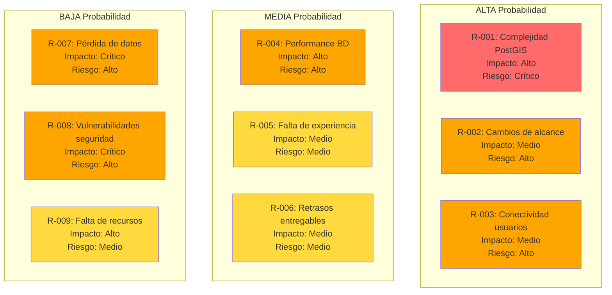

# ⚠️ RISK_ANALYSIS.md - Análisis de Riesgos del Proyecto Civisys

**Versión:** 1.0  
**Fecha:** 2025-11-04  
**Autor:** Equipo Civisys

---

## 📋 Índice

1. [Introducción](#1-introducción)
2. [Metodología de Análisis](#2-metodología-de-análisis)
3. [Matriz de Riesgos](#3-matriz-de-riesgos)
4. [Riesgos Técnicos](#4-riesgos-técnicos)
5. [Riesgos de Proyecto](#5-riesgos-de-proyecto)
6. [Riesgos de Negocio](#6-riesgos-de-negocio)
7. [Riesgos Operacionales](#7-riesgos-operacionales)
8. [Riesgos de Seguridad](#8-riesgos-de-seguridad)
9. [Estrategias de Mitigación](#9-estrategias-de-mitigación)
10. [Plan de Contingencia](#10-plan-de-contingencia)
11. [Monitoreo y Seguimiento](#11-monitoreo-y-seguimiento)

---

## 1. Introducción

Este documento identifica, evalúa y propone estrategias de mitigación para los riesgos asociados al desarrollo e implementación del Sistema Civisys.

**Objetivo:** Minimizar el impacto de riesgos potenciales en el alcance, tiempo, calidad y presupuesto del proyecto.

**Alcance:** Análisis de riesgos desde la fase de desarrollo hasta la operación en producción.

---

## 2. Metodología de Análisis

### 2.1. Escala de Probabilidad

| Nivel | Probabilidad | Descripción |
|-------|--------------|-------------|
| **Alta** | 70-100% | Muy probable que ocurra |
| **Media** | 30-70% | Posible que ocurra |
| **Baja** | 0-30% | Poco probable que ocurra |

### 2.2. Escala de Impacto

| Nivel | Impacto | Descripción |
|-------|---------|-------------|
| **Crítico** | 🔴 Muy Alto | Puede detener el proyecto, pérdida de datos, compromiso de seguridad |
| **Alto** | 🟠 Alto | Retraso significativo, pérdida de funcionalidad importante |
| **Medio** | 🟡 Medio | Retraso moderado, pérdida de funcionalidad menor |
| **Bajo** | 🟢 Bajo | Impacto mínimo, fácil de resolver |

### 2.3. Nivel de Riesgo

El nivel de riesgo se calcula como: **Probabilidad × Impacto**

| Nivel de Riesgo | Acción Requerida |
|-----------------|------------------|
| **Crítico** | Mitigación inmediata, plan de contingencia activo |
| **Alto** | Mitigación prioritaria, monitoreo constante |
| **Medio** | Mitigación planificada, monitoreo regular |
| **Bajo** | Aceptar riesgo o mitigación opcional |

---

## 3. Matriz de Riesgos

### 3.1. Matriz Visual

### 3.2. Resumen de Riesgos

| ID | Riesgo | Probabilidad | Impacto | Nivel | Prioridad |
|----|--------|--------------|---------|-------|-----------|
| R-001 | Complejidad PostGIS | Alta | Alto | 🔴 Crítico | 1 |
| R-002 | Cambios de alcance | Alta | Medio | 🟠 Alto | 2 |
| R-003 | Conectividad usuarios | Alta | Medio | 🟠 Alto | 3 |
| R-004 | Performance base de datos | Media | Alto | 🟠 Alto | 4 |
| R-005 | Falta de experiencia técnica | Media | Medio | 🟡 Medio | 5 |
| R-006 | Retrasos en entregables | Media | Medio | 🟡 Medio | 6 |
| R-007 | Pérdida de datos | Baja | Crítico | 🟠 Alto | 7 |
| R-008 | Vulnerabilidades de seguridad | Baja | Crítico | 🟠 Alto | 8 |
| R-009 | Falta de recursos humanos | Baja | Alto | 🟡 Medio | 9 |

---

## 4. Riesgos Técnicos

### 4.1. R-001: Complejidad PostGIS

**Descripción:**  
La implementación de consultas geográficas con PostGIS puede ser más compleja de lo esperado, especialmente para desarrolladores sin experiencia previa en GIS.

**Probabilidad:** 🔴 Alta (70%)  
**Impacto:** 🟠 Alto  
**Nivel de Riesgo:** 🔴 Crítico

**Consecuencias:**
- Retraso en desarrollo de módulos que requieren geolocalización
- Errores en consultas espaciales
- Dificultad para optimizar consultas geográficas
- Posible necesidad de capacitación adicional

**Estrategias de Mitigación:**
1. **Capacitación previa:** Realizar capacitación en PostGIS antes de iniciar desarrollo
2. **Prototipo temprano:** Crear prototipo funcional de consultas geográficas en Semana 1
3. **Documentación:** Documentar todas las consultas PostGIS con ejemplos
4. **Pair Programming:** Trabajar en parejas en módulos críticos de geolocalización
5. **Consultoría:** Contar con consultoría externa si es necesario (opcional)

**Plan de Contingencia:**
- Si la complejidad es insuperable: Usar biblioteca de abstracción (django-geo-spatial)
- Si hay errores persistentes: Revisar documentación oficial y community
- Si el rendimiento es malo: Optimizar índices GIST y consultas

**Responsable:** Desarrollador Backend  
**Monitoreo:** Revisión semanal de progreso en módulos PostGIS

---

### 4.2. R-004: Performance Base de Datos

**Descripción:**  
Con el crecimiento del número de reportes, las consultas pueden volverse lentas, especialmente las consultas geográficas en el mapa.

**Probabilidad:** 🟡 Media (50%)  
**Impacto:** 🟠 Alto  
**Nivel de Riesgo:** 🟠 Alto

**Consecuencias:**
- Tiempo de carga del mapa muy lento
- Dashboard lento con muchos reportes
- Timeout en consultas complejas
- Mala experiencia de usuario

**Estrategias de Mitigación:**
1. **Índices apropiados:** Crear índices GIST para consultas geográficas desde el inicio
2. **Paginación:** Implementar paginación en listas de reportes
3. **Lazy Loading:** Cargar marcadores del mapa de forma lazy (por zoom level)
4. **Caching:** Implementar caché para consultas frecuentes (opcional)
5. **Optimización de queries:** Evitar N+1 queries, usar select_related/prefetch_related
6. **Límites de consultas:** Limitar número de reportes mostrados en mapa (ej: 100 marcadores)

**Plan de Contingencia:**
- Si el mapa es muy lento: Implementar clustering de marcadores
- Si las consultas timeout: Optimizar queries, agregar índices adicionales
- Si el dashboard es lento: Implementar paginación y lazy loading
- Si es crítico: Considerar Redis para caché (opcional)

**Responsable:** Desarrollador Backend + DevOps  
**Monitoreo:** Monitorear tiempos de respuesta de queries, especialmente PostGIS

---

### 4.3. R-003: Baja Conectividad de Usuarios

**Descripción:**  
Los usuarios en zonas rurales pueden tener conectividad limitada o intermitente, lo que puede afectar la experiencia de uso del sistema.

**Probabilidad:** 🔴 Alta (80%)  
**Impacto:** 🟡 Medio  
**Nivel de Riesgo:** 🟠 Alto

**Consecuencias:**
- Formularios no se envían por conexión lenta
- Fotos no se suben por timeout
- Mapa no carga correctamente
- Frustración de usuarios

**Estrategias de Mitigación:**
1. **Diseño mobile-first:** Optimizar para dispositivos móviles y conexiones lentas
2. **Optimización de recursos:** Minificar CSS/JS, comprimir imágenes
3. **Progressive enhancement:** Funcionalidad básica sin JavaScript
4. **Guardado local:** Guardar formulario en localStorage antes de enviar
5. **Tamaño de fotos:** Comprimir/redimensionar fotos antes de subir
6. **Offline capability:** Considerar Service Workers para funcionalidad offline (futuro)

**Plan de Contingencia:**
- Si las fotos fallan: Implementar retry automático con exponential backoff
- Si el formulario falla: Guardar draft localmente y permitir reenvío
- Si el mapa no carga: Mostrar formulario de entrada manual de coordenadas como fallback

**Responsable:** Desarrollador Frontend  
**Monitoreo:** Testing en conexiones lentas (3G, throttling)

---

### 4.4. R-005: Falta de Experiencia Técnica

**Descripción:**  
El equipo puede no tener experiencia suficiente en algunas tecnologías del stack (Django GIS, PostGIS, Leaflet.js).

**Probabilidad:** 🟡 Media (40%)  
**Impacto:** 🟡 Medio  
**Nivel de Riesgo:** 🟡 Medio

**Consecuencias:**
- Curva de aprendizaje más larga
- Errores de implementación
- Código no optimizado
- Retrasos en desarrollo

**Estrategias de Mitigación:**
1. **Capacitación previa:** Asignar tiempo para capacitación antes de empezar
2. **Documentación:** Crear guías internas para tecnologías clave
3. **Code review:** Revisión de código entre pares
4. **Pair programming:** Trabajar en parejas en módulos complejos
5. **Consultoría:** Contar con mentor/consultor externo (opcional)

**Plan de Contingencia:**
- Si hay retrasos: Ajustar timeline y priorizar funcionalidades core
- Si hay errores críticos: Buscar ayuda en comunidad (Stack Overflow, Django GIS)
- Si es insuperable: Considerar capacitación formal o contratar consultor

**Responsable:** Tech Lead / Desarrolladores  
**Monitoreo:** Revisión semanal de progreso y bloqueadores

---

## 5. Riesgos de Proyecto

### 5.1. R-002: Cambios de Alcance

**Descripción:**  
Durante el desarrollo pueden surgir nuevos requisitos o cambios en los requisitos existentes que afecten el alcance del proyecto.

**Probabilidad:** 🔴 Alta (70%)  
**Impacto:** 🟡 Medio  
**Nivel de Riesgo:** 🟠 Alto

**Consecuencias:**
- Retrasos en entregables
- Aumento de complejidad
- Desviación del alcance original
- Riesgo de no completar MVP a tiempo

**Estrategias de Mitigación:**
1. **Definir MVP claramente:** Documentar qué está dentro y fuera del MVP
2. **Control de cambios:** Proceso formal para evaluar y aprobar cambios
3. **Priorización:** Evaluar impacto de cambios y priorizar
4. **Backlog:** Mantener cambios en backlog para fases futuras
5. **Comunicación:** Comunicar impacto de cambios al equipo

**Plan de Contingencia:**
- Si hay cambios críticos: Ajustar timeline y comunicar retrasos
- Si hay cambios menores: Agregar a backlog para Fase 2
- Si hay cambios de alcance grandes: Re-evaluar MVP y prioridades

**Responsable:** Product Owner  
**Monitoreo:** Revisión semanal de cambios solicitados

---

### 5.2. R-006: Retrasos en Entregables

**Descripción:**  
Los entregables pueden retrasarse por diversas razones (complejidad técnica, cambios de alcance, problemas técnicos).

**Probabilidad:** 🟡 Media (50%)  
**Impacto:** 🟡 Medio  
**Nivel de Riesgo:** 🟡 Medio

**Consecuencias:**
- MVP no disponible a tiempo
- Presión sobre el equipo
- Ajuste de expectativas
- Posible impacto en usuarios

**Estrategias de Mitigación:**
1. **Buffer de tiempo:** Incluir 20% de buffer en estimaciones
2. **Priorización:** Enfocarse en funcionalidades críticas del MVP
3. **Sprints cortos:** Trabajar en sprints de 1-2 semanas
4. **Daily standups:** Identificar bloqueadores temprano
5. **Ajuste continuo:** Ajustar timeline basado en progreso real

**Plan de Contingencia:**
- Si hay retrasos menores (1-2 semanas): Ajustar timeline, comunicar
- Si hay retrasos mayores: Re-evaluar MVP, reducir alcance si es necesario
- Si hay bloqueadores críticos: Re-asignar recursos o buscar ayuda externa

**Responsable:** Project Manager / Tech Lead  
**Monitoreo:** Tracking semanal de progreso vs. plan

---

### 5.3. R-009: Falta de Recursos Humanos

**Descripción:**  
El equipo puede perder miembros o no contar con el número suficiente de desarrolladores para completar el proyecto a tiempo.

**Probabilidad:** 🟢 Baja (20%)  
**Impacto:** 🟠 Alto  
**Nivel de Riesgo:** 🟡 Medio

**Consecuencias:**
- Retraso significativo en entregables
- Sobrecarga de trabajo en el equipo restante
- Riesgo de burnout
- Posible reducción de calidad

**Estrategias de Mitigación:**
1. **Equipo mínimo:** Asegurar equipo mínimo de 2 desarrolladores
2. **Documentación:** Documentar código y decisiones para facilitar onboarding
3. **Distribución de conocimiento:** Pair programming, code reviews
4. **Backup plan:** Identificar desarrolladores de respaldo
5. **Comunicación:** Mantener comunicación clara de expectativas

**Plan de Contingencia:**
- Si se pierde un miembro: Re-asignar tareas, ajustar timeline
- Si falta personal: Buscar desarrollador freelance o consultor
- Si es crítico: Reducir alcance del MVP o extender timeline

**Responsable:** Project Manager  
**Monitoreo:** Revisión mensual de disponibilidad del equipo

---

## 6. Riesgos de Negocio

### 6.1. R-010: Baja Adopción por Usuarios

**Descripción:**  
Los usuarios (ciudadanos, analistas, gestores) pueden no adoptar el sistema o preferir métodos tradicionales.

**Probabilidad:** 🟡 Media (40%)  
**Impacto:** 🟠 Alto  
**Nivel de Riesgo:** 🟠 Alto

**Consecuencias:**
- Sistema no cumple objetivos de negocio
- Bajo ROI del proyecto
- Desperdicio de recursos
- Necesidad de cambios en UX

**Estrategias de Mitigación:**
1. **UX simple:** Diseño intuitivo y fácil de usar
2. **Capacitación:** Capacitar a usuarios clave (analistas, gestores)
3. **Marketing:** Promocionar el sistema a usuarios finales
4. **Feedback temprano:** Obtener feedback de usuarios beta
5. **Mejoras continuas:** Iterar basado en feedback

**Plan de Contingencia:**
- Si hay baja adopción: Re-evaluar UX, realizar entrevistas con usuarios
- Si hay resistencia: Capacitación adicional, demostraciones
- Si es crítico: Rediseñar flujos críticos basado en feedback

**Responsable:** Product Owner + UX Designer  
**Monitoreo:** Métricas de uso (reportes por mes, usuarios activos)

---

### 6.2. R-011: Cambios en Requisitos Regulatorios

**Descripción:**  
Pueden surgir cambios en requisitos legales o regulatorios que afecten el diseño del sistema.

**Probabilidad:** 🟢 Baja (20%)  
**Impacto:** 🟠 Alto  
**Nivel de Riesgo:** 🟡 Medio

**Consecuencias:**
- Necesidad de cambios en diseño
- Retrasos en desarrollo
- Posible necesidad de re-ingeniería

**Estrategias de Mitigación:**
1. **Investigación previa:** Investigar requisitos legales/regulatorios antes de empezar
2. **Diseño flexible:** Diseñar sistema para ser adaptable
3. **Consultoría legal:** Contar con asesoría legal si es necesario
4. **Documentación:** Documentar decisiones de diseño relacionadas con regulaciones

**Plan de Contingencia:**
- Si hay cambios regulatorios: Evaluar impacto y ajustar diseño
- Si es crítico: Re-planificar timeline y alcance
- Si es menor: Agregar a backlog para implementación posterior

**Responsable:** Product Owner + Legal (si aplica)  
**Monitoreo:** Revisión trimestral de cambios regulatorios

---

## 7. Riesgos Operacionales

### 7.1. R-007: Pérdida de Datos

**Descripción:**  
Pérdida de datos por fallos en hardware, errores de software, corrupción de base de datos o desastres naturales.

**Probabilidad:** 🟢 Baja (10%)  
**Impacto:** 🔴 Crítico  
**Nivel de Riesgo:** 🟠 Alto

**Consecuencias:**
- Pérdida de reportes de incidentes
- Pérdida de trazabilidad
- Pérdida de confianza de usuarios
- Posible responsabilidad legal

**Estrategias de Mitigación:**
1. **Backups automáticos:** Backups diarios de base de datos
2. **Backups remotos:** Almacenar backups en ubicación remota
3. **Backups de media:** Backups de fotos y documentos
4. **Pruebas de recuperación:** Probar restauración de backups regularmente
5. **Versionado:** Usar control de versiones para código
6. **Monitoreo:** Monitorear salud de base de datos y servidor

**Plan de Contingencia:**
- Si hay pérdida de datos: Restaurar desde backup más reciente
- Si el backup es corrupto: Usar backup anterior
- Si no hay backup: Evaluar pérdida y comunicar a usuarios
- Si es crítico: Contratar servicio profesional de recuperación de datos

**Responsable:** DevOps + Desarrollador Backend  
**Monitoreo:** Verificación semanal de backups, pruebas mensuales de restauración

---

### 7.2. R-012: Caída del Servidor

**Descripción:**  
El servidor puede caerse por problemas de hardware, software, sobrecarga o ataques DDoS.

**Probabilidad:** 🟡 Media (30%)  
**Impacto:** 🟠 Alto  
**Nivel de Riesgo:** 🟠 Alto

**Consecuencias:**
- Sistema no disponible
- Usuarios no pueden reportar incidentes
- Pérdida de confianza
- Posible impacto en seguridad vial

**Estrategias de Mitigación:**
1. **Monitoreo:** Monitoreo básico de uptime y salud del servidor
2. **Alertas:** Alertas automáticas cuando el servidor cae
3. **Procedimientos:** Procedimientos documentados para recuperación
4. **Redundancia:** Considerar servidor de backup (opcional, futuro)
5. **Load balancing:** Si es necesario (futuro)
6. **Rate limiting:** Prevenir sobrecarga y ataques DDoS

**Plan de Contingencia:**
- Si el servidor cae: Reiniciar servicios, verificar logs
- Si es hardware: Migrar a servidor de backup
- Si es software: Rollback a versión estable
- Si es ataque: Bloquear IPs, aumentar rate limiting

**Responsable:** DevOps  
**Monitoreo:** Monitoreo 24/7 de uptime (UptimeRobot gratuito o similar)

---

### 7.3. R-013: Problemas de Infraestructura

**Descripción:**  
Problemas con el proveedor de hosting, conectividad, o servicios externos (SMTP, mapas).

**Probabilidad:** 🟡 Media (30%)  
**Impacto:** 🟡 Medio  
**Nivel de Riesgo:** 🟡 Medio

**Consecuencias:**
- Servicio intermitente
- Funcionalidades no disponibles
- Mala experiencia de usuario

**Estrategias de Mitigación:**
1. **Proveedor confiable:** Elegir proveedor de hosting con buen uptime
2. **Servicios alternativos:** Tener alternativas para servicios críticos (SMTP)
3. **Fallbacks:** Implementar fallbacks para servicios externos
4. **Monitoreo:** Monitorear salud de servicios externos

**Plan de Contingencia:**
- Si hay problemas con hosting: Migrar a proveedor alternativo
- Si hay problemas con SMTP: Cambiar a servicio alternativo (SendGrid → Gmail)
- Si hay problemas con mapas: Mostrar mensaje de error, permitir entrada manual

**Responsable:** DevOps  
**Monitoreo:** Monitoreo semanal de servicios externos

---

## 8. Riesgos de Seguridad

### 8.1. R-008: Vulnerabilidades de Seguridad

**Descripción:**  
Vulnerabilidades de seguridad pueden ser explotadas por atacantes, comprometiendo datos o el sistema.

**Probabilidad:** 🟢 Baja (20%)  
**Impacto:** 🔴 Crítico  
**Nivel de Riesgo:** 🟠 Alto

**Consecuencias:**
- Compromiso de datos de usuarios
- Acceso no autorizado al sistema
- Modificación o eliminación de datos
- Pérdida de confianza
- Posible responsabilidad legal

**Estrategias de Mitigación:**
1. **Security by Design:** Implementar seguridad desde el diseño (ver `agents.md`)
2. **Autenticación robusta:** Django auth con hashing fuerte (Argon2)
3. **Autorización estricta:** Permisos basados en roles
4. **Validación de entrada:** Validar y sanitizar toda entrada de usuario
5. **HTTPS:** SSL/TLS obligatorio (Let's Encrypt)
6. **Actualizaciones:** Mantener dependencias actualizadas
7. **Auditoría de código:** Code review enfocado en seguridad
8. **Rate limiting:** Prevenir ataques de fuerza bruta
9. **Headers de seguridad:** Configurar headers de seguridad (CSP, HSTS, etc.)

**Plan de Contingencia:**
- Si se detecta vulnerabilidad: Parchear inmediatamente
- Si hay compromiso: Cambiar credenciales, revisar logs de auditoría
- Si es crítico: Tomar sistema offline temporalmente, investigar
- Si hay fuga de datos: Notificar a usuarios, reportar a autoridades si aplica

**Responsable:** Todo el equipo (especialmente Backend)  
**Monitoreo:** Revisión mensual de dependencias, auditorías de seguridad trimestrales

---

### 8.2. R-014: Ataques de Fuerza Bruta

**Descripción:**  
Atacantes pueden intentar acceder al sistema mediante ataques de fuerza bruta en login.

**Probabilidad:** 🟡 Media (40%)  
**Impacto:** 🟡 Medio  
**Nivel de Riesgo:** 🟡 Medio

**Consecuencias:**
- Acceso no autorizado
- Bloqueo de cuentas legítimas
- Sobrecarga del servidor

**Estrategias de Mitigación:**
1. **Rate limiting:** Limitar intentos de login por IP
2. **Captcha:** Implementar reCAPTCHA en login (opcional)
3. **Bloqueo de cuentas:** Bloquear cuentas después de N intentos fallidos
4. **Logs de auditoría:** Registrar todos los intentos de login
5. **Alertas:** Alertar sobre múltiples intentos fallidos

**Plan de Contingencia:**
- Si hay ataque activo: Bloquear IPs, aumentar rate limiting
- Si hay acceso exitoso: Revocar acceso, cambiar contraseñas, investigar

**Responsable:** Desarrollador Backend  
**Monitoreo:** Monitoreo diario de logs de login

---

### 8.3. R-015: Exposición de Datos Sensibles

**Descripción:**  
Datos sensibles de usuarios pueden ser expuestos por error o vulnerabilidad.

**Probabilidad:** 🟢 Baja (20%)  
**Impacto:** 🔴 Crítico  
**Nivel de Riesgo:** 🟠 Alto

**Consecuencias:**
- Violación de privacidad
- Pérdida de confianza
- Posible responsabilidad legal
- Problemas regulatorios

**Estrategias de Mitigación:**
1. **Principio de menor privilegio:** Solo exponer datos necesarios
2. **Anonimización:** Anonimizar datos en exportaciones
3. **Validación de permisos:** Verificar permisos antes de mostrar datos
4. **Sanitización:** Sanitizar datos antes de mostrar en frontend
5. **Logs seguros:** No registrar datos sensibles en logs
6. **Variables de entorno:** No hardcodear credenciales

**Plan de Contingencia:**
- Si hay exposición: Eliminar datos expuestos, notificar a usuarios
- Si es crítico: Investigar alcance, reportar a autoridades si aplica

**Responsable:** Todo el equipo  
**Monitoreo:** Revisión regular de qué datos se exponen en cada endpoint

---

## 9. Estrategias de Mitigación

### 9.1. Estrategias por Tipo de Riesgo

#### 9.1.1. Riesgos Técnicos

**Estrategia Principal:** Capacitación + Prototipos + Documentación

1. **Capacitación previa:** Asignar tiempo para aprender tecnologías nuevas
2. **Prototipos tempranos:** Crear prototipos funcionales antes de implementación completa
3. **Documentación:** Documentar decisiones técnicas y soluciones
4. **Code review:** Revisión de código entre pares
5. **Testing:** Testing exhaustivo, especialmente TDD

#### 9.1.2. Riesgos de Proyecto

**Estrategia Principal:** Control de Alcance + Comunicación + Buffer

1. **Control de alcance:** Definir MVP claramente, proceso para cambios
2. **Comunicación:** Comunicación clara y frecuente con stakeholders
3. **Buffer de tiempo:** 20% de buffer en estimaciones
4. **Priorización:** Priorizar funcionalidades críticas
5. **Ajuste continuo:** Ajustar timeline basado en progreso real

#### 9.1.3. Riesgos Operacionales

**Estrategia Principal:** Redundancia + Monitoreo + Procedimientos

1. **Backups:** Backups automáticos y regulares
2. **Monitoreo:** Monitoreo de salud del sistema
3. **Procedimientos:** Procedimientos documentados para incidentes
4. **Redundancia:** Servicios alternativos cuando sea posible
5. **Pruebas:** Pruebas regulares de recuperación

#### 9.1.4. Riesgos de Seguridad

**Estrategia Principal:** Security by Design + Auditoría + Actualizaciones

1. **Security by Design:** Implementar seguridad desde el diseño
2. **Auditoría:** Auditorías regulares de código y dependencias
3. **Actualizaciones:** Mantener dependencias actualizadas
4. **Monitoreo:** Monitoreo de intentos de acceso no autorizado
5. **Capacitación:** Capacitar equipo en seguridad

---

## 10. Plan de Contingencia

### 10.1. Escenarios de Contingencia

#### Escenario 1: Riesgo Crítico Materializado

**Ejemplo:** Pérdida de datos o vulnerabilidad de seguridad crítica

**Acciones Inmediatas:**
1. Evaluar impacto inmediato
2. Tomar acciones correctivas (restaurar backup, parchear vulnerabilidad)
3. Comunicar a stakeholders
4. Documentar incidente
5. Investigar causa raíz
6. Implementar medidas preventivas

**Responsable:** Tech Lead + DevOps  
**Tiempo de Respuesta:** < 4 horas

#### Escenario 2: Retraso Significativo (> 2 semanas)

**Acciones Inmediatas:**
1. Evaluar impacto en timeline
2. Re-evaluar alcance del MVP
3. Priorizar funcionalidades críticas
4. Comunicar retrasos a stakeholders
5. Ajustar plan de proyecto
6. Considerar recursos adicionales

**Responsable:** Project Manager  
**Tiempo de Respuesta:** < 1 semana

#### Escenario 3: Pérdida de Miembro del Equipo

**Acciones Inmediatas:**
1. Evaluar impacto en entregables
2. Re-asignar tareas
3. Documentar conocimiento perdido
4. Buscar reemplazo o consultor
5. Ajustar timeline si es necesario
6. Comunicar cambios al equipo

**Responsable:** Project Manager  
**Tiempo de Respuesta:** < 1 semana

#### Escenario 4: Cambio de Alcance Crítico

**Acciones Inmediatas:**
1. Evaluar impacto técnico y de timeline
2. Re-evaluar MVP
3. Priorizar cambios solicitados
4. Comunicar impacto a stakeholders
5. Decidir: incluir en MVP o diferir
6. Ajustar plan y timeline

**Responsable:** Product Owner  
**Tiempo de Respuesta:** < 3 días

---

## 11. Monitoreo y Seguimiento

### 11.1. Revisión de Riesgos

**Frecuencia:** Semanal durante desarrollo, mensual en producción

**Proceso:**
1. Revisar lista de riesgos identificados
2. Evaluar cambios en probabilidad/impacto
3. Identificar nuevos riesgos
4. Actualizar estrategias de mitigación
5. Documentar cambios

**Responsable:** Project Manager + Tech Lead

### 11.2. Métricas de Monitoreo

| Métrica | Frecuencia | Responsable |
|---------|------------|-------------|
| **Progreso vs. Plan** | Semanal | Project Manager |
| **Cobertura de Tests** | Semanal | Desarrolladores |
| **Performance de Queries** | Semanal | Backend Developer |
| **Uptime del Servidor** | Diario | DevOps |
| **Backups Exitosos** | Semanal | DevOps |
| **Intentos de Login Fallidos** | Diario | Backend Developer |
| **Vulnerabilidades en Dependencias** | Mensual | Tech Lead |

### 11.3. Dashboard de Riesgos

**Actualización:** Semanal

**Contenido:**
- Estado de riesgos críticos y altos
- Nuevos riesgos identificados
- Riesgos mitigados
- Acciones pendientes

---

## 12. Referencias

- **Documentación del Proyecto:** `/README.md`
- **Plan de Proyecto:** `/PROJECT_PLAN.md`
- **Arquitectura del Sistema:** `/ARCHITECTURE.md`
- **Guía para Agentes:** `/agents.md`
- **OWASP Top 10:** https://owasp.org/www-project-top-ten/

---

## 13. Aprobaciones

| Rol | Nombre | Firma | Fecha |
|-----|--------|-------|-------|
| **Product Owner** | - | - | - |
| **Tech Lead** | - | - | - |
| **Project Manager** | - | - | - |

---

**Última actualización:** 2025-11-04  
**Mantenido por:** Equipo de Desarrollo Civisys  
**Próxima Revisión:** Semanal durante desarrollo, mensual en producción

