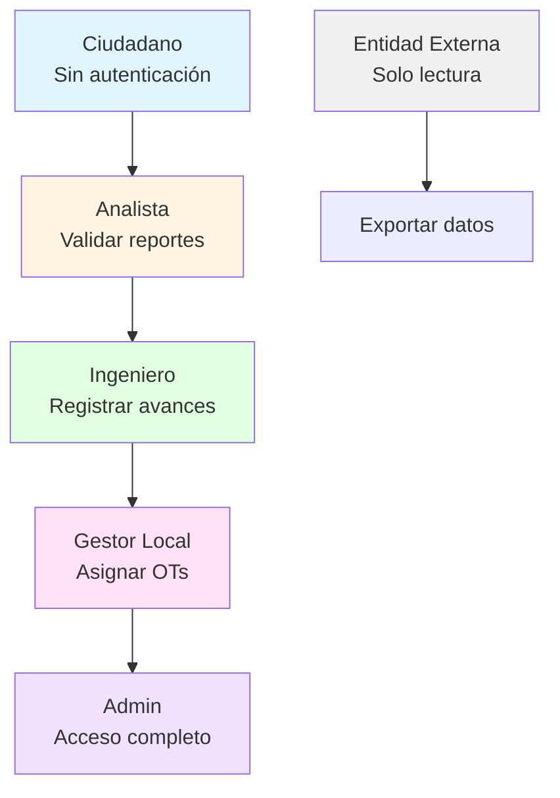
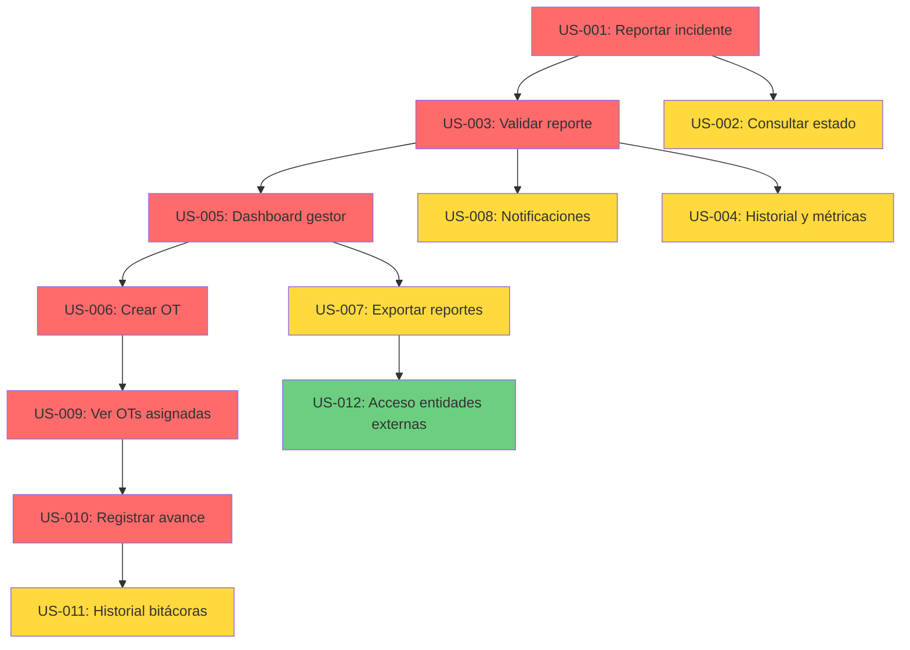

# 📝 USER_STORIES.md - Historias de Usuario del Sistema Civisys

**Versión:** 1.0  
**Fecha:** 2025-11-04  
**Autor:** Equipo Civisys

---

## 📋 Índice

1. [Introducción](#1-introducción)
2. [Roles de Usuario](#2-roles-de-usuario)
3. [Historias de Usuario](#3-historias-de-usuario)
   - [3.1. Ciudadano](#31-ciudadano)
   - [3.2. Analista](#32-analista)
   - [3.3. Gestor Local](#33-gestor-local)
   - [3.4. Ingeniero Residente](#34-ingeniero-residente)
   - [3.5. Entidades Externas](#35-entidades-externas)
4. [Priorización](#4-priorización)
5. [Criterios de Aceptación](#5-criterios-de-aceptación)

---

## 1. Introducción

Este documento contiene todas las **Historias de Usuario** (User Stories) del Sistema Civisys, estructuradas en el formato estándar:

> **Como** [rol], **quiero** [qué], **para que** [beneficio]

Cada historia incluye:
- **Descripción** en formato estándar
- **Criterios de aceptación** en formato Gherkin
- **Prioridad** (Alta, Media, Baja)
- **Estimación** (Story Points)
- **Dependencias** con otras historias

---

## 2. Roles de Usuario

### 2.1. Roles Principales

| Rol | Descripción | Permisos |
|-----|-------------|----------|
| **Ciudadano** | Usuario final que reporta incidentes | Lectura pública, creación de reportes |
| **Analista** | Responsable de validar y clasificar reportes | Validar reportes, asignar severidad |
| **Gestor Local** | Administrador que coordina recursos | Ver reportes, asignar OTs, exportar datos |
| **Ingeniero Residente** | Ejecutor de obras de mitigación | Ver OTs asignadas, registrar avances |
| **Entidad Externa** | Instituciones que requieren información | Solo lectura, exportación de datos |

### 2.2. Jerarquía de Permisos



---

## 3. Historias de Usuario

---

### 3.1. Ciudadano

#### US-001: Reportar un incidente de derrumbe

**Como** ciudadano,  
**quiero** reportar un incidente de derrumbe con ubicación geográfica y evidencia fotográfica,  
**para que** las autoridades puedan tomar acción inmediata sobre el riesgo vial.

**Prioridad:** 🔴 Alta  
**Story Points:** 5  
**Dependencias:** Ninguna

**Criterios de Aceptación:**

```gherkin
Feature: Reporte de incidente por ciudadano

  Scenario: Ciudadano reporta un derrumbe exitosamente
    Given Que el ciudadano accede al formulario de reporte
    When El ciudadano completa los campos obligatorios (ubicación, descripción)
      And El ciudadano selecciona una ubicación en el mapa
      And El ciudadano adjunta una foto opcional
      And El ciudadano proporciona su email opcional
    Then El sistema guarda el reporte con un ID único
      And El sistema asigna el estado "recibido"
      And El sistema registra la fecha y hora de creación
      And El sistema genera un acuse de recibo al remitente (si email proporcionado)
      And El reporte queda disponible para revisión por analistas

  Scenario: Ciudadano reporta sin proporcionar email
    Given Que el ciudadano accede al formulario de reporte
    When El ciudadano completa los campos obligatorios
      And El ciudadano no proporciona email
    Then El sistema guarda el reporte con estado "recibido"
      And El sistema muestra un mensaje de confirmación con ID del reporte
      And El sistema NO envía email de confirmación

  Scenario: Ciudadano intenta reportar sin ubicación
    Given Que el ciudadano accede al formulario de reporte
    When El ciudadano completa la descripción pero NO selecciona ubicación
    Then El sistema muestra un mensaje de error indicando que la ubicación es obligatoria
      And El reporte NO se guarda
```

**Notas Técnicas:**
- El formulario debe funcionar en dispositivos móviles con baja conectividad
- La ubicación debe capturarse mediante selección en mapa (Leaflet.js) o GPS del dispositivo
- Las fotos deben validarse por tamaño y formato antes de subir

---

#### US-002: Consultar el estado de un reporte

**Como** ciudadano,  
**quiero** consultar el estado de mi reporte usando un ID único,  
**para que** pueda saber si mi alerta fue recibida y está siendo gestionada.

**Prioridad:** 🟡 Media  
**Story Points:** 3  
**Dependencias:** US-001

**Criterios de Aceptación:**

```gherkin
Feature: Consulta de estado de reporte

  Scenario: Ciudadano consulta reporte existente
    Given Que existe un reporte con ID "12345"
    When El ciudadano ingresa el ID "12345" en el formulario de consulta
    Then El sistema muestra el estado actual del reporte
      And El sistema muestra la fecha de creación
      And El sistema muestra la ubicación del incidente
      And El sistema muestra el historial de cambios de estado (si aplica)

  Scenario: Ciudadano consulta reporte inexistente
    Given Que NO existe un reporte con ID "99999"
    When El ciudadano ingresa el ID "99999"
    Then El sistema muestra un mensaje indicando que el reporte no fue encontrado

  Scenario: Ciudadano consulta sin autenticación
    Given Que el ciudadano NO está autenticado
    When El ciudadano consulta un reporte
    Then El sistema permite la consulta (acceso público para reportes)
      And El sistema muestra solo información pública (no datos sensibles)
```

**Notas Técnicas:**
- La consulta debe ser pública (sin autenticación)
- El ID debe ser alfanumérico y fácil de recordar/compartir
- Considerar mostrar un mapa con la ubicación del incidente

---

### 3.2. Analista

#### US-003: Validar y clasificar un reporte

**Como** analista,  
**quiero** validar reportes recibidos y asignarles una severidad (alta/media/baja),  
**para que** los gestores puedan priorizar las acciones de mitigación.

**Prioridad:** 🔴 Alta  
**Story Points:** 5  
**Dependencias:** US-001

**Criterios de Aceptación:**

```gherkin
Feature: Validación de reportes por analista

  Scenario: Analista valida un reporte recibido
    Given Que existe un reporte con estado "recibido"
      And El analista está autenticado con rol "analista"
    When El analista accede al dashboard de reportes pendientes
      And El analista selecciona un reporte
      And El analista revisa la descripción y evidencia
      And El analista confirma que el reporte es válido
      And El analista asigna severidad "alta"
      And El analista añade observaciones opcionales
    Then El sistema cambia el estado del reporte a "validado"
      And El sistema registra la severidad asignada
      And El sistema registra el timestamp de validación
      And El sistema registra el ID del analista que validó
      And El sistema genera un log de auditoría
      And El reporte queda disponible para asignación de OT

  Scenario: Analista descarta un reporte inválido
    Given Que existe un reporte con estado "recibido"
      And El analista está autenticado con rol "analista"
    When El analista selecciona un reporte
      And El analista determina que el reporte es falso o duplicado
      And El analista cambia el estado a "descartado"
    Then El sistema cambia el estado a "descartado"
      And El sistema registra el timestamp de descarte
      And El sistema genera un log de auditoría
      And El reporte NO queda disponible para asignación de OT

  Scenario: Usuario sin permisos intenta validar
    Given Que un usuario NO tiene rol "analista"
    When El usuario intenta acceder a la funcionalidad de validación
    Then El sistema muestra un error 403 (Forbidden)
      And El sistema NO permite cambiar el estado del reporte
```

**Notas Técnicas:**
- El dashboard debe mostrar reportes ordenados por fecha de creación (más antiguos primero)
- Debe haber filtros por severidad, fecha, estado
- La validación debe ser una acción atómica (transacción de BD)

---

#### US-004: Ver historial y métricas de reportes

**Como** analista,  
**quiero** ver el historial de reportes y métricas de tiempos de respuesta,  
**para que** pueda medir la eficiencia del proceso de validación.

**Prioridad:** 🟡 Media  
**Story Points:** 3  
**Dependencias:** US-003

**Criterios de Aceptación:**

```gherkin
Feature: Historial y métricas de reportes

  Scenario: Analista consulta historial de reportes
    Given Que el analista está autenticado
    When El analista accede al panel de historial
    Then El sistema muestra una lista de todos los reportes procesados
      And El sistema muestra el tiempo transcurrido desde recepción hasta validación
      And El sistema muestra estadísticas agregadas (promedio, mediana, máximo)

  Scenario: Analista filtra reportes por severidad
    Given Que existen reportes con diferentes severidades
    When El analista aplica filtro por severidad "alta"
    Then El sistema muestra solo reportes con severidad "alta"
      And El sistema mantiene el filtro aplicado en la navegación
```

---

### 3.3. Gestor Local

#### US-005: Visualizar reportes validados en dashboard

**Como** gestor local,  
**quiero** ver un panel consolidado con todos los reportes validados,  
**para que** tenga visibilidad inmediata de los incidentes que requieren acción.

**Prioridad:** 🔴 Alta  
**Story Points:** 5  
**Dependencias:** US-003

**Criterios de Aceptación:**

```gherkin
Feature: Dashboard de reportes para gestor

  Scenario: Gestor accede al dashboard
    Given Que el gestor está autenticado con rol "gestor"
      Y Existen reportes validados en el sistema
    When El gestor accede al dashboard principal
    Then El sistema muestra una lista de reportes validados
      And El sistema muestra filtros por severidad (alta/media/baja)
      And El sistema muestra filtros por fecha
      And El sistema muestra un mapa con la ubicación de los incidentes
      And El sistema muestra contadores por estado (validado, asignado, cerrado)
      And El sistema muestra estadísticas básicas (total reportes, pendientes, etc.)

  Scenario: Gestor filtra reportes por severidad alta
    Given Que existen reportes con diferentes severidades
    When El gestor selecciona filtro "severidad: alta"
    Then El sistema muestra solo reportes con severidad "alta"
      And El mapa se actualiza mostrando solo incidentes de alta severidad
```

**Notas Técnicas:**
- El dashboard debe cargar rápidamente incluso con muchos reportes
- Considerar paginación o lazy loading para el mapa
- El mapa debe usar Leaflet.js con OpenStreetMap

---

#### US-006: Crear orden de trabajo y asignar ingeniero

**Como** gestor local,  
**quiero** crear una orden de trabajo vinculada a un reporte validado y asignarla a un ingeniero,  
**para que** se inicie el proceso de mitigación del incidente.

**Prioridad:** 🔴 Alta  
**Story Points:** 8  
**Dependencias:** US-003, US-005

**Criterios de Aceptación:**

```gherkin
Feature: Creación de orden de trabajo

  Scenario: Gestor crea OT y asigna ingeniero
    Given Que existe un reporte con estado "validado"
      And El gestor está autenticado con rol "gestor"
      Y Existen ingenieros disponibles en el sistema
    When El gestor selecciona el reporte validado
      And El gestor hace clic en "Crear Orden de Trabajo"
      And El gestor selecciona un ingeniero de la lista
      And El gestor confirma la creación de la OT
    Then El sistema crea una orden de trabajo vinculada al reporte
      And El sistema cambia el estado del reporte a "asignado"
      And El sistema registra el timestamp de asignación
      And El sistema registra el ID del gestor que asignó
      And El sistema registra el ID del ingeniero asignado
      And El sistema envía una notificación por email al ingeniero
      And El sistema genera un log de auditoría
      And La OT queda con estado "pendiente"

  Scenario: Gestor intenta crear OT para reporte no validado
    Given Que existe un reporte con estado "recibido" (no validado)
    When El gestor intenta crear una OT para ese reporte
    Then El sistema muestra un error indicando que el reporte debe estar validado
      And El sistema NO crea la OT

  Scenario: Gestor intenta crear OT duplicada
    Given Que existe un reporte con estado "asignado" (ya tiene OT)
    When El gestor intenta crear otra OT para ese reporte
    Then El sistema muestra un error indicando que el reporte ya tiene una OT
      And El sistema NO crea una OT duplicada
```

**Notas Técnicas:**
- Una OT debe tener relación 1:1 con un reporte (UNIQUE constraint)
- La notificación por email debe ser asíncrona (usar Celery o tarea en background)
- Debe validarse que el usuario asignado tenga rol "ingeniero"

---

#### US-007: Exportar reportes a PDF/CSV

**Como** gestor local,  
**quiero** exportar reportes filtrados a formatos PDF o CSV,  
**para que** pueda compartir información con entidades externas o generar reportes oficiales.

**Prioridad:** 🟡 Media  
**Story Points:** 5  
**Dependencias:** US-005

**Criterios de Aceptación:**

```gherkin
Feature: Exportación de reportes

  Scenario: Gestor exporta reportes a CSV
    Given Que el gestor está autenticado
      Y El gestor tiene filtros aplicados en el dashboard
    When El gestor selecciona "Exportar a CSV"
    Then El sistema genera un archivo CSV con los reportes filtrados
      And El archivo CSV incluye: ID, fecha, ubicación, descripción, severidad, estado
      And El sistema permite descargar el archivo
      And El sistema genera un log de auditoría de la exportación

  Scenario: Gestor exporta reportes a PDF
    Given Que el gestor está autenticado
    When El gestor selecciona "Exportar a PDF"
    Then El sistema genera un documento PDF con formato profesional
      And El PDF incluye: encabezado, tabla de reportes, mapa con ubicaciones (opcional)
      And El sistema permite descargar el archivo PDF
      And El sistema genera un log de auditoría

  Scenario: Gestor exporta datos sin filtros
    Given Que el gestor NO aplica filtros
    When El gestor exporta a CSV
    Then El sistema exporta TODOS los reportes disponibles
      And El sistema muestra un mensaje de advertencia si hay muchos registros
```

**Notas Técnicas:**
- Usar `reportlab` para generación de PDFs
- Usar `csv` nativo de Python para CSV
- Considerar límite de registros para evitar timeouts (ej: máximo 10,000 registros)

---

#### US-008: Recibir notificaciones de eventos críticos

**Como** gestor local,  
**quiero** recibir notificaciones por correo electrónico cuando se reporten incidentes de alta severidad,  
**para que** pueda tomar acción inmediata en situaciones de riesgo crítico.

**Prioridad:** 🟡 Media  
**Story Points:** 3  
**Dependencias:** US-001, US-003

**Criterios de Aceptación:**

```gherkin
Feature: Notificaciones de eventos críticos

  Scenario: Gestor recibe notificación de reporte de alta severidad
    Given Que el gestor tiene configurado su email en el sistema
      Y Un analista valida un reporte con severidad "alta"
    When El sistema registra el reporte como validado con severidad alta
    Then El sistema envía un email al gestor
      And El email incluye: ID del reporte, ubicación, descripción, fecha
      And El email incluye un enlace directo al reporte en el dashboard
      And El sistema registra el envío del email en el log de auditoría

  Scenario: Gestor recibe notificación de múltiples reportes críticos
    Given Que se validan 3 reportes de alta severidad en un corto período
    When El sistema procesa las validaciones
    Then El sistema puede agrupar las notificaciones en un solo email (opcional)
      O El sistema envía notificaciones individuales por cada reporte
```

**Notas Técnicas:**
- Usar SMTP de Gmail (gratis) o SendGrid (plan gratuito)
- Configurar variables de entorno para credenciales SMTP
- Considerar rate limiting para evitar spam de emails

---

### 3.4. Ingeniero Residente

#### US-009: Ver órdenes de trabajo asignadas

**Como** ingeniero residente,  
**quiero** ver todas las órdenes de trabajo que me han sido asignadas,  
**para que** pueda conocer mis responsabilidades y planificar el trabajo.

**Prioridad:** 🔴 Alta  
**Story Points:** 3  
**Dependencias:** US-006

**Criterios de Aceptación:**

```gherkin
Feature: Visualización de OTs asignadas

  Scenario: Ingeniero ve sus órdenes de trabajo
    Given Que el ingeniero está autenticado con rol "ingeniero"
      Y Existen OTs asignadas a este ingeniero
    When El ingeniero accede al panel "Mis Órdenes de Trabajo"
    Then El sistema muestra una lista de todas las OTs asignadas
      And El sistema muestra el estado de cada OT (pendiente, en_progreso, finalizada)
      And El sistema muestra la fecha de asignación
      And El sistema muestra la ubicación del incidente asociado
      And El sistema muestra el reporte vinculado (descripción, severidad)
      And El sistema permite filtrar por estado

  Scenario: Ingeniero ve OTs pendientes
    Given Que el ingeniero tiene OTs en diferentes estados
    When El ingeniero filtra por estado "pendiente"
    Then El sistema muestra solo las OTs con estado "pendiente"
      And El sistema ordena por fecha de asignación (más antiguas primero)
```

---

#### US-010: Registrar avance de obra con bitácora

**Como** ingeniero residente,  
**quiero** registrar el avance de una obra con texto, fotos y porcentaje de progreso,  
**para que** haya trazabilidad completa del proceso de mitigación.

**Prioridad:** 🔴 Alta  
**Story Points:** 8  
**Dependencias:** US-009

**Criterios de Aceptación:**

```gherkin
Feature: Registro de avance de obra

  Scenario: Ingeniero registra avance de obra
    Given Que el ingeniero está autenticado con rol "ingeniero"
      Y Existe una OT asignada al ingeniero con estado "pendiente" o "en_progreso"
    When El ingeniero selecciona la OT
      And El ingeniero accede a "Registrar Avance"
      And El ingeniero completa el texto de la bitácora (obligatorio)
      And El ingeniero adjunta fotos de evidencia (opcional)
      And El ingeniero indica el porcentaje de avance (0-100%)
      And El ingeniero guarda el registro
    Then El sistema crea una entrada en la bitácora (work_order_log)
      And El sistema registra el autor (ingeniero)
      And El sistema registra el timestamp de creación
      And El sistema guarda las fotos en el sistema de archivos
      And El sistema actualiza el estado de la OT a "en_progreso" (si estaba pendiente)
      And El sistema actualiza el campo "updated_at" de la OT
      And El sistema genera un log de auditoría
      And El historial de bitácoras se mantiene inmutable

  Scenario: Ingeniero finaliza obra (100% de avance)
    Given Que el ingeniero registra avance con porcentaje 100%
    When El ingeniero guarda el registro
    Then El sistema actualiza el estado de la OT a "finalizada"
      And El sistema registra el timestamp de finalización
      And El sistema notifica al gestor que la OT está finalizada
      And El sistema genera un log de auditoría

  Scenario: Ingeniero intenta registrar avance sin texto
    Given Que el ingeniero intenta registrar avance
    When El ingeniero NO completa el texto de la bitácora
      Y El ingeniero intenta guardar
    Then El sistema muestra un error indicando que el texto es obligatorio
      And El sistema NO guarda el registro

  Scenario: Ingeniero intenta registrar avance en OT no asignada
    Given Que existe una OT asignada a otro ingeniero
    When El ingeniero intenta registrar avance en esa OT
    Then El sistema muestra un error 403 (Forbidden)
      And El sistema NO permite registrar el avance
```

**Notas Técnicas:**
- Las bitácoras son inmutables (no se pueden editar ni eliminar)
- El porcentaje de avance debe validarse (0-100%)
- Las fotos deben validarse por tamaño y formato
- Considerar límite de tamaño por foto (ej: máximo 5MB)

---

#### US-011: Ver historial de bitácoras de una OT

**Como** ingeniero residente,  
**quiero** ver el historial completo de bitácoras de una orden de trabajo,  
**para que** pueda revisar el progreso registrado y mantener continuidad en el trabajo.

**Prioridad:** 🟡 Media  
**Story Points:** 2  
**Dependencias:** US-010

**Criterios de Aceptación:**

```gherkin
Feature: Historial de bitácoras

  Scenario: Ingeniero ve historial de bitácoras
    Given Que existe una OT con múltiples entradas de bitácora
    When El ingeniero accede al detalle de la OT
    Then El sistema muestra todas las bitácoras ordenadas por fecha (más recientes primero)
      And El sistema muestra: fecha, autor, texto, fotos, porcentaje de avance
      And El sistema muestra una línea de tiempo visual del progreso
```

---

### 3.5. Entidades Externas

#### US-012: Acceder a reportes consolidados (solo lectura)

**Como** entidad externa (ej: INVÍAS, ANI),  
**quiero** acceder a reportes consolidados en formato estándar,  
**para que** pueda tomar decisiones interinstitucionales basadas en datos homogéneos.

**Prioridad:** 🟢 Baja  
**Story Points:** 5  
**Dependencias:** US-007

**Criterios de Aceptación:**

```gherkin
Feature: Acceso de entidades externas

  Scenario: Entidad externa accede a reportes
    Given Que la entidad tiene credenciales de acceso con rol "entidad_externa"
    When La entidad se autentica en el sistema
      Y La entidad accede al panel de reportes
    Then El sistema muestra una vista de solo lectura de reportes
      And El sistema NO permite modificar, validar o asignar reportes
      And El sistema permite exportar datos a CSV/PDF
      And El sistema muestra solo información pública (no datos sensibles de usuarios)

  Scenario: Entidad externa exporta datos consolidados
    Given Que la entidad está autenticada
    When La entidad solicita exportación de datos
    Then El sistema genera un archivo con datos consolidados
      And El archivo incluye: resumen estadístico, listado de reportes, ubicaciones
      And El sistema genera un log de auditoría de la exportación
```

**Notas Técnicas:**
- Este rol debe tener permisos muy restrictivos (solo lectura)
- Considerar límites de rate limiting para exportaciones
- Los datos exportados deben ser anonimizados si contienen información sensible

---

## 4. Priorización

### 4.1. Matriz de Priorización

| Prioridad | Color | Descripción | Historias |
|-----------|-------|-------------|-----------|
| **Alta** | 🔴 | Crítico para MVP | US-001, US-003, US-005, US-006, US-009, US-010 |
| **Media** | 🟡 | Importante pero no bloqueante | US-002, US-004, US-007, US-008, US-011 |
| **Baja** | 🟢 | Mejora futura | US-012 |

### 4.2. Roadmap por Fases

**Fase 1 (MVP - Crítico):**
- US-001: Reportar incidente
- US-003: Validar reporte
- US-005: Dashboard gestor
- US-006: Crear OT
- US-009: Ver OTs asignadas
- US-010: Registrar avance

**Fase 2 (Mejoras):**
- US-002: Consultar estado
- US-004: Historial y métricas
- US-007: Exportar reportes
- US-008: Notificaciones
- US-011: Historial bitácoras

**Fase 3 (Integraciones):**
- US-012: Acceso entidades externas

---

## 5. Criterios de Aceptación

### 5.1. Criterios Generales (Definition of Done)

Todas las historias de usuario deben cumplir con:

- ✅ **Funcionalidad:** La funcionalidad implementada cumple con los criterios de aceptación
- ✅ **Tests:** Existen tests unitarios y de integración que cubren la funcionalidad
- ✅ **Seguridad:** Se implementan validaciones de permisos y protección contra vulnerabilidades
- ✅ **Auditoría:** Las acciones críticas generan logs de auditoría
- ✅ **Documentación:** El código incluye docstrings y comentarios cuando es necesario
- ✅ **UX:** La interfaz es usable en dispositivos móviles y con baja conectividad
- ✅ **Performance:** Las consultas son eficientes (usar índices, evitar N+1 queries)

### 5.2. Criterios Técnicos Específicos

**Backend:**
- Usar `django.contrib.gis.db.models` para campos geográficos
- Validar permisos con decoradores `@permission_required` o `@login_required`
- Usar transacciones de BD para operaciones críticas
- Implementar rate limiting para prevenir abuso

**Frontend:**
- Diseño mobile-first con Bootstrap 5
- Validación client-side (HTML5) + server-side (Django)
- Mapas interactivos con Leaflet.js
- Mensajes de error claros y útiles

**Base de Datos:**
- Usar índices GIST para consultas geográficas
- Foreign keys con ON DELETE apropiado
- Constraints de CHECK para validar rangos (ej: porcentaje 0-100%)

---

## 6. Dependencias entre Historias



---

## 7. Estimación Total

| Fase | Story Points | Prioridad |
|------|--------------|-----------|
| Fase 1 (MVP) | 34 | 🔴 Alta |
| Fase 2 (Mejoras) | 16 | 🟡 Media |
| Fase 3 (Integraciones) | 5 | 🟢 Baja |
| **Total** | **55** | - |

**Nota:** La estimación en Story Points es relativa. Para convertir a horas/días, usar el factor de conversión del equipo (ej: 1 SP = 8 horas).

---

## 8. Referencias

- **Documentación del Proyecto:** `/README.md`
- **Arquitectura del Sistema:** `/ARCHITECTURE.md`
- **Guía para Agentes:** `/agents.md`
- **Esquema de Base de Datos:** `/context/database.sql`

---

**Última actualización:** 2025-11-04  
**Mantenido por:** Equipo de Desarrollo Civisys

